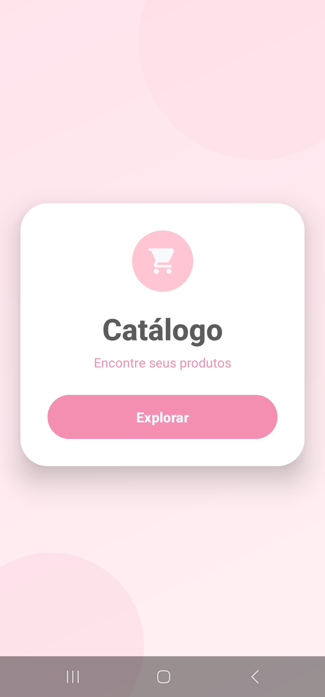
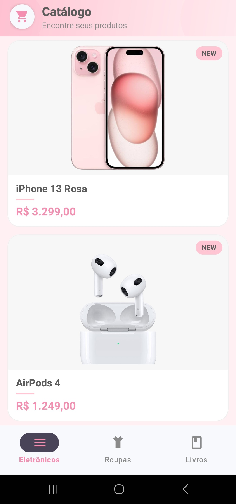
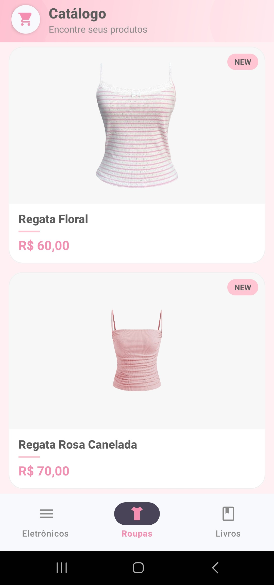

# 🛍️ AppUI - Catálogo de Produtos

Aplicativo Android desenvolvido em **Kotlin** para navegação em um catálogo de produtos organizado por categorias. Construído com componentes do Material Design e navegação por fragments.

---

## 📋 Funcionalidades

### 1. 🎉 Tela de Boas-vindas (`WelcomeActivity`)
Tela inicial com identidade visual do app.

**Comportamento:**
- Exibe logo, título e subtítulo do catálogo
- Botão **Explorar** redireciona para a tela principal

### 2. 🗂️ Catálogo por Categorias (`MainActivity`)
Exibe os produtos organizados em três categorias via `BottomNavigationView`.

**Comportamento:**
- Navegação entre **Eletrônicos**, **Roupas** e **Livros**
- Cada categoria exibe uma lista de produtos em cards
- Cards com imagem centralizada, nome, subtítulo (autor, para livros) e preço

---

## 📸 Screenshots

<table>
  <tr>
    <th align="center">Boas-vindas</th>
    <th align="center">Eletrônicos</th>
    <th align="center">Roupas</th>
    <th align="center">Livros</th>
  </tr>
  <tr>
    <td align="center"></td>
    <td align="center"></td>
    <td align="center"></td>
    <td align="center"></td>
  </tr>
</table>

---

## 🗂️ Estrutura do Projeto

```
app/src/main/
├── java/br/edu/fatecpg/appui/
│   ├── adapter/
│   │   └── ProdutoAdapter.kt
│   ├── model/
│   │   └── Produto.kt
│   └── view/
│       ├── ListaFragment.kt
│       ├── MainActivity.kt
│       └── WelcomeActivity.kt
└── res/
    ├── color/
    │   └── nav_item_color.xml
    ├── drawable/
    │   ├── bg_gradient.xml
    │   ├── bg_header.xml
    │   ├── bg_tag.xml
    │   ├── blob_bottom.xml
    │   ├── blob_top.xml
    │   ├── ic_book.xml
    │   ├── ic_devices.xml
    │   ├── ic_shirt.xml
    │   ├── ic_shopping_cart.xml
    │   ├── img_blusa.png
    │   ├── img_blusa_rosa.png
    │   ├── img_casaco.png
    │   ├── img_celular.png
    │   ├── img_fone.png
    │   ├── img_livro_um.jpg
    │   ├── img_livro_dois.jpg
    │   ├── img_livro_tres.jpg
    │   ├── img_monitor.png
    │   └── img_notebook.png
    ├── layout/
    │   ├── activity_main.xml
    │   ├── activity_welcome.xml
    │   ├── fragment_lista.xml
    │   └── item_produto.xml
    ├── menu/
    │   └── menu_bottom.xml
    └── values/
        ├── colors.xml
        ├── strings.xml
        └── themes/
```

---

## 🧩 Modelo de Dados

```kotlin
data class Produto(
    val nome: String,
    val preco: String,
    val imagem: Int,
    val fundoTransparente: Boolean = false,
    val subtitulo: String? = null
)
```

---

## 🛍️ Produtos do Catálogo

### Eletrônicos
| Produto | Preço |
|---|---|
| iPhone 13 Rosa | R$ 3.299,00 |
| AirPods 4 | R$ 1.249,00 |
| Monitor | R$ 1.200,00 |
| MacBook Air Estelar | R$ 7.499,00 |

### Roupas
| Produto | Preço |
|---|---|
| Regata Floral | R$ 60,00 |
| Regata Rosa Canelada | R$ 70,00 |
| Jaqueta Adidas | R$ 150,00 |

### Livros
| Produto | Autor | Preço |
|---|---|---|
| A Razão do Amor | Ali Hazelwood | R$ 80,00 |
| Para Todos os Garotos que Já Amei | Jenny Han | R$ 75,00 |
| Orgulho e Preconceito | Jane Austen | R$ 90,00 |

---

## 🏗️ Arquitetura

Projeto estruturado em camadas simples de **View + Adapter + Model**.

| Camada | Responsabilidade |
|---|---|
| **WelcomeActivity** | Tela inicial e navegação para o catálogo |
| **MainActivity** | Navegação entre categorias via BottomNavigation |
| **ListaFragment** | Exibição da lista de produtos por categoria |
| **ProdutoAdapter** | Binding dos dados nos cards do RecyclerView |
| **Produto** | Modelo de dados do produto |

---

## 🛠️ Tecnologias

- **Linguagem:** Kotlin
- **Componentes de UI:** `MaterialCardView`, `CoordinatorLayout`, `MaterialButton`, `BottomNavigationView`, `RecyclerView`
- **Navegação:** Fragments com `BottomNavigationView`
- **Tema:** Material Design com paleta rosa personalizada

---

## ▶️ Como executar

1. Clone o repositório:
   ```bash
   git clone https://github.com/seuusuario/AppUI.git
   ```
2. Abra o projeto no **Android Studio**
3. Conecte um dispositivo ou inicie um emulador
4. Certifique-se que a **Depuração USB** está ativada no dispositivo
5. Clique em **Run ▶️** (ou `Shift + F10`)
